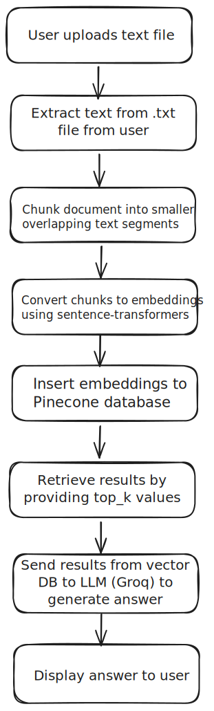

# Private Knowledge Q&A System

A RAG (Retrieval-Augmented Generation) system that allows you to upload documents and ask questions about them using AI.

## Tech Stack

### Backend
- **FastAPI** - Modern Python web framework
- **Uvicorn** - ASGI server
- **Pinecone** - Vector database for document embeddings
- **Groq** - LLM API for question answering
- **Sentence Transformers** - Text embedding models
- **Python 3.11**

### Frontend
- **Next.js 16** - React framework
- **React 19** - UI library
- **TypeScript** - Type-safe JavaScript
- **Tailwind CSS** - Utility-first CSS framework

### Infrastructure
- **Docker** - Containerization
- **Docker Compose** - Multi-container orchestration

## How It Works

The system follows a RAG (Retrieval-Augmented Generation) workflow:



**Workflow Steps:**
1. **Upload** - User uploads a text file
2. **Extract** - System extracts text from the file
3. **Chunk** - Document is split into smaller overlapping segments
4. **Embed** - Text chunks are converted to vector embeddings using sentence-transformers
5. **Store** - Embeddings are stored in Pinecone vector database
6. **Query** - User asks a question about the document
7. **Retrieve** - System finds relevant chunks using similarity search
8. **Generate** - Retrieved context is sent to Groq LLM to generate an answer
9. **Display** - Answer is shown to the user

## Quick Start

### Option 1: Using Docker (Recommended)

**Prerequisites:**
- Docker and Docker Compose installed

**Steps:**

1. **Set up environment variables**
   ```bash
   # Copy environment files
   cp client/.env.example client/.env
   cp server/.env.example server/.env
   ```
   
   Edit `server/.env` and add your API keys:
   - `GROQ_API_KEY` - Get from [Groq Console](https://console.groq.com/)
   - `PINECONE_API_KEY` - Get from [Pinecone Console](https://www.pinecone.io/)

2. **Start the application**
   ```bash
   docker compose up --build
   ```

3. **Access the application**
   - Frontend: http://localhost:3000
   - Backend API: http://localhost:8000/docs

**To stop:** Press `Ctrl+C` or run `docker compose down`

---

### Option 2: Without Docker (Manual Setup)

**Prerequisites:**
- Python 3.11 or higher
- Node.js 18 or higher
- npm or yarn

**Backend Setup:**

1. **Navigate to server directory**
   ```bash
   cd server
   ```

2. **Create virtual environment**
   
   On Windows:
   ```bash
   python -m venv venv
   venv\Scripts\activate
   ```
   
   On macOS/Linux:
   ```bash
   python3 -m venv venv
   source venv/bin/activate
   ```

3. **Install dependencies**
   ```bash
   pip install -r requirements.txt
   ```

4. **Set up environment variables**
   ```bash
   cp .env.example .env
   ```
   
   Edit `.env` and add your API keys:
   - `GROQ_API_KEY` - Get from [Groq Console](https://console.groq.com/)
   - `PINECONE_API_KEY` - Get from [Pinecone Console](https://www.pinecone.io/)

5. **Run the backend server**
   ```bash
   uvicorn main:app --reload --host 0.0.0.0 --port 8000
   ```

**Frontend Setup:**

1. **Open a new terminal and navigate to client directory**
   ```bash
   cd client
   ```

2. **Install dependencies**
   ```bash
   npm install
   ```

3. **Set up environment variables**
   ```bash
   cp .env.example .env
   ```
   
   Edit `.env` and set:
   ```
   NEXT_PUBLIC_API_URL=http://localhost:8000
   ```

4. **Run the frontend**
   ```bash
   npm run dev
   ```

5. **Access the application**
   - Frontend: http://localhost:3000
   - Backend API: http://localhost:8000/docs

## Notes

- Make sure ports 3000 (frontend) and 8000 (backend) are available
- First-time setup may take a few minutes to download dependencies
- You need valid API keys from Groq and Pinecone for the system to work

## Development

**View Docker logs:**
```bash
docker compose logs -f
```

**Rebuild after code changes:**
```bash
docker compose up --build
```

**Without Docker - Backend hot reload:**
The `--reload` flag in uvicorn automatically restarts on code changes

**Without Docker - Frontend hot reload:**
Next.js dev server (`npm run dev`) automatically reloads on changes

